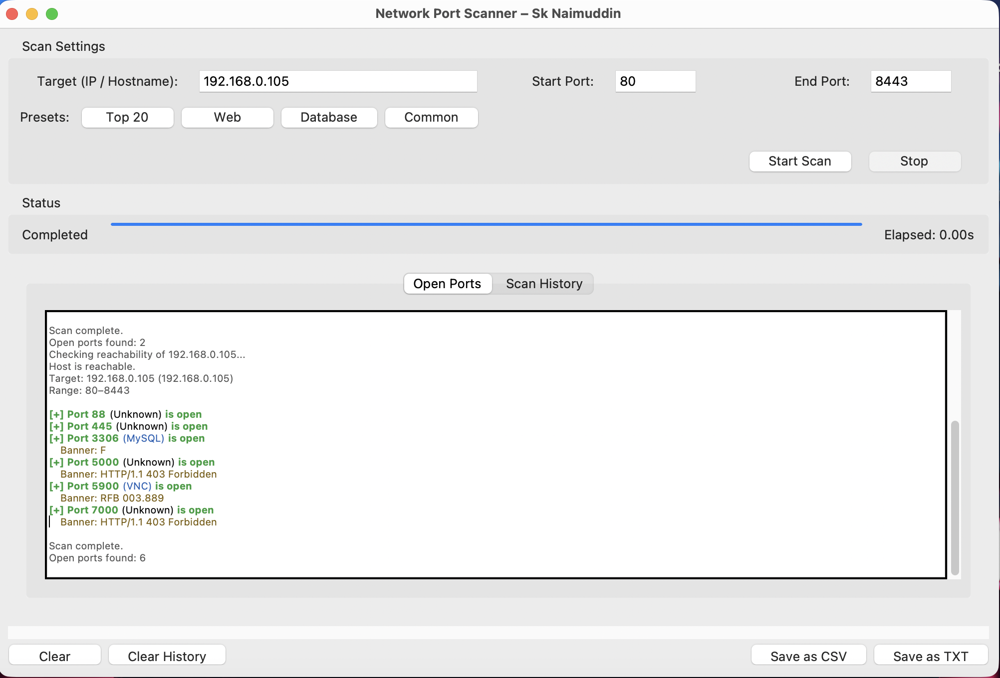

# 🌐 Network Port Scanner (GUI-Based)

A modern, high-performance, multi-threaded network port scanner built using Python and Tkinter.  
This tool provides real-time scanning, banner grabbing, scan history, and export features in a clean graphical interface.

---

  

## 🚀 Features

### 🔍 Multi-threaded Port Scanning
- Uses Python threading for high-speed scanning
- Efficient scanning of large port ranges (1–65535)
- Controlled concurrency using semaphore

---

### 🌐 Target Resolution
- Accepts both:
  - IP addresses (e.g., `192.168.1.1`)
  - Hostnames (e.g., `google.com`)
- Automatically resolves hostname to IP

---

### 📡 Service Detection
- Identifies common services:
  - 80 → HTTP
  - 443 → HTTPS
  - 22 → SSH
  - 3306 → MySQL
- Unknown ports are labeled accordingly

---

### 🧠 Banner Grabbing
- Attempts to retrieve service banners
- Helps identify:
  - Server type
  - Running service
  - Partial version info

---

## ⚙️ Technologies Used

- Python 3
- socket programming
- threading
- Tkinter (GUI)
- subprocess (ping)
- csv module

---

## 🧠 How It Works

1. User inputs:
   - Target (IP or hostname)
   - Port range

2. System:
   - Resolves hostname to IP
   - Checks host reachability

3. Scanner:
   - Creates multiple threads
   - Scans ports using socket connections

4. If port is open:
   - Service is identified
   - Banner is captured (if available)

5. Results:
   - Displayed in real-time
   - Stored in scan history
   - Export in csv or txt file

---

## ⚠️ Disclaimer

This tool is intended for educational and ethical use only.

- Do not scan unauthorized systems
- Always take proper permission before scanning any network

---

## 🔮 Future Improvements

- OS Detection
- Network-wide scanning
- UDP scanning support
- Graphical analytics dashboard
- AI-based vulnerability detection

---

## 👨‍💻 Author

**Sk Naimuddin**

- Cybersecurity Enthusiast
- IoT Developer
- AI/ML Learner

---

## ⭐ Support

If you like this project:

- ⭐ Star the repository
- 🍴 Fork it
- 🤝 Contribute

---

## 🤝 Contribution

1. Fork the repository
2. Create a new branch
3. Make changes
4. Submit a pull request

---

## 📬 Contact

Open for collaboration and project ideas 🚀

